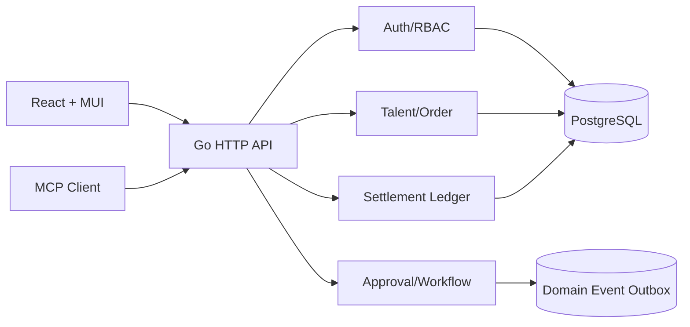

# Kkiit 아키텍처 결정

## 배포 단위

초기 배포는 물리적 마이크로서비스가 아닌 Go 모듈러 모놀리스 하나입니다. 인증, 사용자, 재능, 주문, 정산, 승인, AI, MCP의 테이블과 API 경계를 분리하고, 도메인 이벤트를 Transactional Outbox에 기록합니다. 이후 NATS/Kafka 또는 독립 서비스로 옮겨도 API와 이벤트 계약을 유지할 수 있습니다.



React 결과물은 Go binary에 embed하여 이미지 하나로 제공합니다. 런타임 네트워크 의존성은 운영자가 지정한 PostgreSQL뿐입니다. 외부 OAuth와 AI Gateway는 관리자가 활성화할 때만 선택적으로 호출합니다.

## 설정과 비밀

1. 네 개의 부트스트랩 환경변수로 DB와 암호화 root를 구성합니다.
2. 비밀이 아닌 운영 정책은 `system_settings.value` JSONB에 버전과 함께 저장합니다.
3. Client Secret과 API Token 같은 비밀은 `ENCRYPTION_KEY`를 사용하는 AES-256-GCM으로 암호화합니다. associated data에 설정 목적과 식별자를 넣어 ciphertext 교체 공격을 줄입니다.
4. 개인 API Key 원문은 발급 순간 한 번만 반환하며 SHA-256 digest만 저장합니다.
5. 역할 권한을 축소하면 기존 키 scope도 역할 권한과 교집합으로 평가되므로 즉시 축소됩니다.

`ENCRYPTION_KEY` 교체는 모든 암호화 컬럼을 트랜잭션으로 재암호화하는 별도 운영 절차가 필요합니다. 기존 key 없이 새 key만 배포하면 비밀 설정을 복호화할 수 없습니다.

## 주문 상태

상태는 `orderTransitions` 허용표를 통해서만 바뀝니다. Timeline과 Outbox 이벤트는 상태 변경과 동일 DB transaction에서 생성합니다.

```text
CREATED → PAYMENT_PENDING → PAID → REQUIREMENT_PENDING/READY
READY → IN_PROGRESS → DELIVERED → ACCEPTED → COMPLETED
                         ↘ REVISION_REQUESTED → IN_PROGRESS
```

취소, 분쟁과 환불 전이도 명시적으로 제한합니다. 주문 소유권은 buyer/seller ABAC로 평가하고 운영 권한만 전체 주문을 볼 수 있습니다.

## 금융 원장

구매확정 시 `Escrow debit = Platform Revenue credit + Seller Payable credit` 관계로 항목을 추가합니다. 금액은 KRW 최소 단위 정수로 보관하여 부동소수점 오차를 방지합니다. PG Adapter와 실제 지급 실행은 다음 결제 통합 단계에서 이 계약에 연결합니다.

## 승인 정책

승인은 opt-in입니다. 자원 유형에 활성 정책이 없거나 활성 정책의 조건이 자원과 일치하지 않으면 요청 생성과 승인 상태를 모두 건너뜁니다. 정책이 일치하면 원 자원과 `approval_requests`를 같은 transaction에서 대기 상태로 바꿉니다. 관리자 결정 역시 자원 상태와 Outbox 이벤트를 한 transaction에서 갱신합니다.

상품 공개 정책은 금액 범위, `HUMAN`/`AI`/`HYBRID` 유형, 판매자 등급과 상품 품질 점수 조건을 지원합니다. 조건 객체가 비어 있으면 모든 상품에 적용됩니다.

## 감사와 운영 복구

관리자 변경, 인증, 상품, 거래, 정산과 키 작업은 요청 ID·세션·행위자·변경 전후 데이터를 감사로그에 기록합니다. PostgreSQL trigger가 감사로그의 `UPDATE`와 `DELETE`를 거부하므로 애플리케이션 계층을 우회한 변경도 차단합니다. 결제와 주문 상태 변경에는 idempotency key와 Transactional Outbox를 사용하며, 이벤트는 처리 상태·재시도 횟수·마지막 오류를 보존해 향후 Replay worker와 연결할 수 있습니다.
