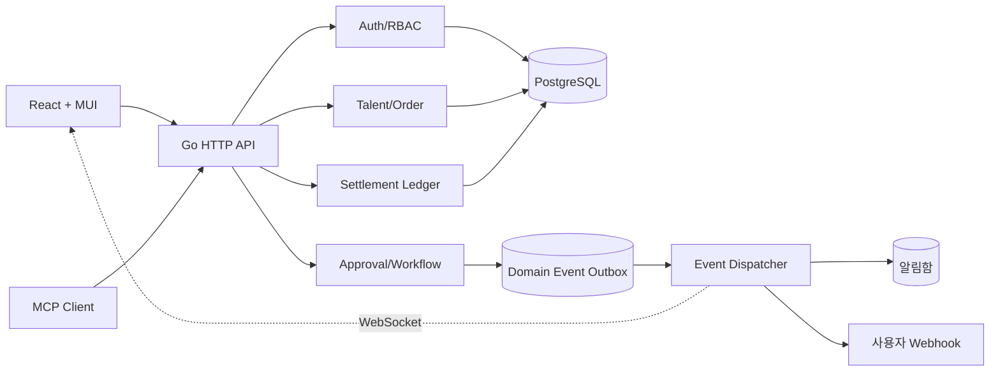

# Kkiit 아키텍처 결정

## 배포 단위

초기 배포는 물리적 마이크로서비스가 아닌 Go 모듈러 모놀리스 하나입니다. 인증, 사용자, 재능, 주문, 정산, 승인, AI, MCP의 테이블과 API 경계를 분리하고, 도메인 이벤트를 Transactional Outbox에 기록합니다. 이후 NATS/Kafka 또는 독립 서비스로 옮겨도 API와 이벤트 계약을 유지할 수 있습니다.



React 결과물은 Go binary에 embed하여 이미지 하나로 제공합니다. 런타임 네트워크 의존성은 운영자가 지정한 PostgreSQL뿐입니다. 외부 OAuth와 AI Gateway는 관리자가 활성화할 때만 선택적으로 호출합니다.

## 설정과 비밀

1. 네 개의 부트스트랩 환경변수로 DB와 암호화 root를 구성합니다.
2. 비밀이 아닌 운영 정책은 `system_settings.value` JSONB에 버전과 함께 저장합니다.
3. Client Secret과 API Token 같은 비밀은 `ENCRYPTION_KEY`를 사용하는 AES-256-GCM으로 암호화합니다. associated data에 설정 목적과 식별자를 넣어 ciphertext 교체 공격을 줄입니다.
4. 개인 API Key 원문은 발급 순간 한 번만 반환하며 SHA-256 digest만 저장합니다.
5. 역할 권한을 축소하면 기존 키 scope도 역할 권한과 교집합으로 평가되므로 즉시 축소됩니다.

`ENCRYPTION_KEY` 교체는 모든 암호화 컬럼을 트랜잭션으로 재암호화하는 별도 운영 절차가 필요합니다. 기존 key 없이 새 key만 배포하면 비밀 설정을 복호화할 수 없습니다.

## 주문 상태

상태는 `orderTransitions` 허용표를 통해서만 바뀝니다. Timeline과 Outbox 이벤트는 상태 변경과 동일 DB transaction에서 생성합니다.

```text
CREATED → PAYMENT_PENDING → PAID → REQUIREMENT_PENDING/READY
READY → IN_PROGRESS → DELIVERED → ACCEPTED → COMPLETED
                         ↘ REVISION_REQUESTED → IN_PROGRESS
```

취소, 분쟁과 환불 전이도 명시적으로 제한합니다. 주문 소유권은 buyer/seller ABAC로 평가하고 운영 권한만 전체 주문을 볼 수 있습니다.

## 금융 원장

구매확정 시 `Escrow debit = Platform Revenue credit + Seller Payable credit` 관계로 항목을 추가합니다. 금액은 KRW 최소 단위 정수로 보관하여 부동소수점 오차를 방지합니다. PG Adapter와 실제 지급 실행은 다음 결제 통합 단계에서 이 계약에 연결합니다.

## 분쟁과 환불

`DISPUTED` 상태는 주문 상태표에만 있고 실제 분쟁 기록·환불·원장 정정이 없으면 돈의 흐름이 끊깁니다. 분쟁은 다음 계약으로 닫습니다.

1. 구매자·판매자·운영자가 `IN_PROGRESS`, `DELIVERED`, `REVISION_REQUESTED`, `ACCEPTED` 상태에서 분쟁을 접수합니다. 같은 주문에 열린 분쟁은 partial unique index로 하나만 허용합니다.
2. 접수는 주문을 `DISPUTED`로 바꾸고 예정된 정산을 `hold`로 잠급니다. 검토 중에는 돈이 움직이지 않습니다.
3. 운영자 결정은 `refund_full`, `refund_partial`, `release_to_seller` 셋뿐입니다. 처리 시 이미 기록된 정산을 원장에서 되돌리고, 환불분과 판매자 몫을 다시 기록합니다. 전액 환불이면 주문은 `REFUNDED`, 그 외에는 `COMPLETED`가 됩니다.
4. 이미 `completed`로 지급까지 끝난 정산은 자동으로 되돌리지 않고 409로 거부합니다. 실제 회수는 운영 절차의 몫입니다.

주문 종료 시 반환액은 주문 상태가 아니라 원장의 에스크로 잔액에서 파생합니다. 상태별로 "이 경우에는 얼마를 돌려준다"를 나열하면 새 경로가 생길 때마다 빠뜨릴 수 있지만, 남아 있는 잔액을 돌려주는 규칙은 경로가 늘어도 성립합니다. 이미 정산된 주문은 잔액이 0이므로 같은 코드가 아무 일도 하지 않습니다.

같은 이유로 구매확정은 전용 엔드포인트와 일반 상태 전이가 동일한 함수를 호출합니다. 두 경로 중 하나만 정산을 기록하면 판매자가 대금을 받지 못하는 상태가 만들어집니다. 분쟁 중인 주문의 종료는 일반 전이에서 거부하고 분쟁 처리로 보냅니다.

에스크로가 움직이는 모든 경로(결제, 구매확정, 분쟁 처리)는 차변과 대변 합계가 같은지 검사하는 한 함수를 지나갑니다. 합계가 어긋나면 원장을 남기는 대신 비즈니스 transaction 전체가 실패합니다. 따라서 분쟁이 구매확정 전에 열렸든 후에 열렸든 주문별 원장 합계는 항상 0이고 `Escrow` 계정 잔액도 0으로 닫힙니다.

## 위험 평가와 정산 진행

관리자 위험 큐가 비어 있으면 예외 운영은 시작되지 않습니다. 디스패처는 주기적으로 진행 중인 주문을 다시 평가합니다.

1. 한 SQL로 주문별 사실을 모으고(구매자 계정 나이, 24시간 주문 수, 양측 분쟁 비율, 판매자 완료 이력, 납기 초과, 수정 횟수, 금액) 규칙은 Go에서 계산합니다. 데이터베이스 없이 단위 테스트할 수 있고 규칙을 읽을 수 있습니다.
2. 규칙마다 코드·이름·가중치·설명이 있는 신호를 남깁니다. 저장된 점수는 항상 "왜 올라왔는지"를 함께 보여줍니다.
3. `risk_scores`는 append-only입니다. 등급이 바뀌거나 점수가 5점 이상 움직일 때만 새 행을 쓰고, 대기열은 자원별 최신 행만 보여줍니다.
4. 등급이 `settlement.policy.hold_levels`에 속하고 `risk.policy.auto_hold_settlement`가 켜져 있으면 `settlement_hold` 조치를 붙입니다.

정산은 예정일이 지나면 디스패처가 처리합니다. 위험 등급이 보류 대상이면 `hold`로 잠그고, 아니면 `settlement.policy.batch_enabled`가 켜져 있을 때만 `confirmed`로 올립니다. 어느 경우에도 돈을 옮기지 않습니다. 실제 지급은 운영자가 명시적으로 실행하는 동작으로 남겨 둡니다.

임계치, 스캔 주기와 배치 크기는 `risk.policy`, 보류 등급과 자동 배치는 `settlement.policy`에서 조정합니다. 규칙이나 임계치를 바꾼 뒤에는 관리자 `분쟁·위험`의 `지금 재평가`로 다음 주기를 기다리지 않고 결과를 확인할 수 있습니다.

## 신뢰 점수와 랭킹

`seller_profiles.level`은 승인 정책 조건에 쓰이지만 계산하는 코드가 없으면 모든 판매자가 `NEW`에 머뭅니다. 디스패처가 기본 15분마다 두 가지를 다시 계산합니다.

**판매자 신뢰 점수(0~100)**는 자기 신고가 아니라 완료된 거래에서만 만들어집니다. 리뷰 평점 40, 정시 납품 20, 완료율 15, 분쟁 없음 10, 첫 응답 속도 10, 거래량 5로 나눕니다. 이력이 없는 항목은 0이 아니라 절반을 주므로 신규 계정이 실적 나쁜 계정보다 아래로 밀리지 않습니다. 등급은 점수와 완료 건수를 함께 요구해 리뷰 하나로 배지를 살 수 없습니다.

리뷰 평균은 `seller_profiles.rating`으로 분리했습니다. 이전에는 같은 컬럼(`score`)이 1~5 평점을 담고 있어 랭킹 계산이 척도를 섞어 쓰고 있었습니다.

**상품 품질 점수(0~100)**는 판매자 점수 40%, 상세 설명·패키지·FAQ 충실도 20%, 주문 실적 15%, 구매자 만족도 15%, 최신성 10%입니다. 두 점수 모두 append-only 이력 테이블(`seller_scores`, `talent_scores`)에 남기되 값이 실제로 움직였을 때만 행을 추가합니다.

검색 정렬은 텍스트 적합도만으로는 비어 있는 신규 상품과 검증된 상품을 나란히 세웁니다. `search.policy`의 가중치로 텍스트 0.5, 품질 0.35, 최신성 0.15을 섞습니다. 추천은 `matching.weights`를 읽되 **플랫폼이 실제로 측정할 수 있는 요소만** 사용하고 각 요소의 기여도를 응답에 함께 돌려주므로, 왜 추천됐는지 숫자 하나가 아니라 근거로 설명됩니다.

## 공개 파일과 비공개 파일

`file_objects`는 주문 첨부와 포트폴리오 미디어를 함께 담습니다. 업로드 시 `metadata.visibility`에 `private` 또는 `public`을 새기고, 내려받기는 이 값을 먼저 확인합니다.

- `public`: 누구나 받을 수 있고 이미지면 `inline`으로 응답합니다. 판매자가 `POST /api/v1/me/files`로 올린 포트폴리오 미디어만 이 표시를 받습니다.
- `private`: 소유자, 해당 주문의 당사자, `orders.manage` 권한자만 받을 수 있습니다. 주문 첨부는 항상 여기에 해당합니다.

내려받기 경로 자체는 인증을 요구하지 않습니다. 비로그인 방문자가 상품 페이지의 포트폴리오 이미지를 볼 수 있어야 하기 때문이며, 권한 판정은 라우터가 아니라 핸들러가 파일 단위로 수행합니다.

## 쿠폰과 프로모션 회계

할인을 주문 금액에서 그냥 빼면 판매자 정산액까지 줄어들어 계약과 어긋납니다. 그래서 `orders.amount`는 정가를 유지하고 `discount_amount`를 따로 둡니다. 결제는 구매자 결제액과 프로모션 비용 두 차변이 에스크로 한 대변과 균형을 이루고, 구매확정은 쿠폰과 무관하게 전액을 정산합니다.

환불은 비례 배분합니다. 환불액 R에 대해 구매자 몫은 `R × (주문액 − 할인액) / 주문액`, 나머지는 프로모션 회수입니다. 정수 나눗셈의 나머지는 프로모션 쪽으로 흡수되므로 합계는 항상 R이고 원장은 닫힙니다. 구매자 몫이 0이 되는 100% 할인 주문에서는 환불 레코드를 만들지 않고 회수만 기록합니다.

사용 한도 검사는 주문 트랜잭션 안에서 `SELECT ... FOR UPDATE`로 쿠폰 행을 잠그고 수행합니다. 동시에 들어온 두 주문이 마지막 한 장을 함께 쓰는 상황을 막습니다.

## 신고 처리와 집행

신고 큐는 상태를 바꾸는 것만으로는 의미가 없습니다. 처리 완료 표시와 실제 집행이 어긋나면 운영 기록을 신뢰할 수 없기 때문에, `resolveReport`는 결정 기록과 집행을 한 트랜잭션에서 수행합니다. 상품 비공개는 `talents.status='paused'`와 `TalentPaused` 이벤트를, 계정 정지는 `users.status='suspended'`를 같은 커밋에 넣습니다. 세션 폐기만 커밋 이후에 수행합니다 — 실패해도 정지 자체를 되돌리지 않아야 하기 때문입니다.

집행 대상 판정은 신고 자원 유형에 따라 다릅니다. 상품 신고에 계정 정지를 적용하면 그 상품의 판매자를 정지하고, 사용자 신고면 그 사용자를 정지합니다. 관리자 권한 계정과 처리자 본인은 이 경로로 정지할 수 없습니다.

정지 효과는 조회 시점에 적용합니다. 상품마다 상태를 바꾸는 대신 공개 질의가 판매자 상태를 함께 확인하므로, 정지와 복구가 카탈로그 전체에 즉시 반영되고 되돌리기도 한 번에 됩니다.

## 목록 읽기와 요청 한도

`OFFSET`은 깊은 페이지에서 느려지고, 읽는 동안 새 행이 들어오면 창이 밀려 같은 행을 두 번 보여줍니다. 그래서 감사 로그·관리자 주문·알림함은 `(정렬 키, id)` 튜플 비교로 keyset 페이징을 합니다. 한 건을 더 조회해 다음 페이지 유무를 판단하고, 응답 크기는 요청한 만큼으로 잘라 커서와 함께 돌려줍니다.

커서는 정렬 키와 행 id를 base64로 담은 불투명 문자열입니다. 해독에 실패하면 요청을 거부하지 않고 최신 페이지부터 시작합니다 — 오래된 북마크가 운영 콘솔을 막는 것보다 낫습니다.

요청 한도는 API 키 한도와 같은 고정 창 카운터를 공유합니다. 고정 창은 경계에서 버스트가 겹칠 수 있지만 별도 정리 작업이 필요 없다는 점을 교환한 선택이며, 맵이 일정 크기를 넘으면 만료된 항목을 걷어냅니다. 키는 로그인 사용자면 계정, 아니면 IP입니다.

## 조직 예산

예산은 `orders.budget_id`와 `orders.budget_consumed`에 예약분을 함께 기록합니다. 반환은 "이 주문이 아직 들고 있는 만큼, 최대 N까지"로 정의되므로 같은 취소가 재시도돼도 예산이 부풀지 않고, 부분 환불에서는 구매자가 실제로 돌려받은 금액만 빠집니다.

예약은 주문 트랜잭션 안에서 `SELECT ... FOR UPDATE`로 예산 행을 잠그고 수행합니다. 동시에 들어온 두 주문이 남은 잔액을 함께 쓰지 못합니다. 활성 예산이 여러 개면 먼저 끝나는 것부터 사용합니다.

조직 역할은 플랫폼 권한과 분리되어 있습니다. 플랫폼 운영자는 조직 구성원이 아니므로 이 경로로는 조직 데이터를 볼 수 없고, 운영이 필요하면 관리자 콘솔을 사용합니다.

## 배경 작업과 상태 기계

만료와 자동 구매확정은 주문 상태 기계와 정산 원장을 그대로 지나가야 합니다. 그래서 이 로직을 워커에 복제하지 않고, 워커가 HTTP 계층이 제공하는 함수를 호출합니다(`Worker.Maintenance`). 반대 방향인 `Server.Rescan`과 같은 구조이며, 결과적으로 결제·정산 회계는 한 곳에만 존재합니다.

이를 위해 `applyOrderTransition`과 구매확정 정산 경로는 `*http.Request` 대신 `context.Context`를 받습니다. 배경 작업이 만든 전이는 행위자가 없으므로 타임라인의 `actor_user_id`와 감사 로그의 행위자를 NULL로 남기고, 감사 역할은 `system`으로 표시합니다. 운영자가 한 일과 시스템이 한 일을 로그에서 구분할 수 있어야 하기 때문입니다.

선택과 실행은 분리되어 있습니다. 대상을 한 번에 조회한 뒤 건별 트랜잭션에서 상태를 다시 확인하고 처리하므로, 조회와 처리 사이에 구매자가 결제하거나 확정한 주문은 건너뜁니다.

## 소셜 계정 연결

외부 제공자의 `sub`은 계정과 1:1로 묶이지만, 아직 묶이지 않은 로그인이 들어오면 누구의 것인지 판단해야 합니다. 이때 이메일 일치만 보는 구현은 계정 탈취 경로가 됩니다. 확인되지 않은 주소를 주장하는 제공자를 하나만 등록해도 남의 계정, 심지어 관리자 계정으로 들어갈 수 있기 때문입니다.

판단은 순수 함수 하나로 모았습니다. 확인된 이메일이고, 대상 계정에 자체 비밀번호가 없고, 관리자 권한도 없을 때만 자동으로 연결합니다. 그 외에는 계정을 만들지도 연결하지도 않고 거절하며, 사용자는 기존 수단으로 로그인한 뒤 설정에서 직접 연결합니다.

직접 연결은 같은 OAuth 흐름을 재사용하되 인가 요청 상태에 요청자를 담아 두고(`oauth_states.link_user_id`), 콜백에서 그 사용자에게 identity를 붙입니다. 이미 다른 사용자에게 묶인 `sub`은 옮기지 않고 거절합니다.

## 2단계 인증

RFC 6238 코드는 시간 창 전체에서 유효하므로 검증만으로는 재사용을 막을 수 없습니다. 검증 함수가 일치한 시간 창을 돌려주고, 저장 시 `last_step < 새 step` 조건부 UPDATE로 그 창을 소비합니다. 조건이 맞지 않으면 갱신된 행이 없고 인증은 실패합니다 — 잠금이나 애플리케이션 상태 없이 데이터베이스 한 번의 쓰기로 1회성을 보장합니다. 등록 확인에 쓴 코드도 같은 방식으로 소비하므로 그대로 로그인에 재사용할 수 없습니다.

2단계 인증에는 복구 경로가 반드시 필요합니다. 인증 앱을 잃은 사용자를 되살릴 방법이 없으면 단일 관리자 환경은 영구히 잠깁니다. `users.manage` 권한자가 MFA를 초기화할 수 있게 하고, 초기화 시 해당 계정의 세션을 함께 폐기해 2차 인증으로 열린 세션이 살아남지 않도록 합니다. 모든 초기화는 감사 로그에 남습니다.

## 가격을 정하는 쪽

주문 금액을 이루는 값은 모두 서버가 저장한 것에서 나옵니다. 상품 기본가와 패키지 가격은 물론 추가 옵션도 요청 본문의 숫자가 아니라 `talent_options` 행에서 읽습니다. 요청은 무엇을 고를지만 말하고 얼마인지는 말하지 않습니다.

쿠폰 할인도 같은 원칙을 따릅니다. 클라이언트는 코드만 보내고 할인액은 서버가 계산합니다. 이 규칙 덕분에 결제 금액을 검증하는 자리가 한 곳으로 모이고, 원장의 균형 검사와 예산 예약이 신뢰할 수 있는 값을 다룹니다.

## 원장이 닫히는 지점

주문 하나의 원장은 결제로 열려 구매확정과 지급으로 닫힙니다. 지급을 기록하지 않으면 `Seller Payable`은 이미 나간 돈에 대한 부채로 영원히 남습니다. 그래서 정산 완료는 상태 변경과 같은 트랜잭션에서 지급 분개를 씁니다.

계정별로 보면 정상 종료된 주문은 `Escrow` 0, `Seller Payable` 0으로 닫히고, 남는 것은 플랫폼 수익과 실제 현금 흐름을 나타내는 계정뿐입니다. 취소와 환불도 같은 성질을 갖도록 에스크로 잔액에서 반환액을 파생합니다.

## 승인 정책

승인은 opt-in입니다. 자원 유형에 활성 정책이 없거나 활성 정책의 조건이 자원과 일치하지 않으면 요청 생성과 승인 상태를 모두 건너뜁니다. 정책이 일치하면 원 자원과 `approval_requests`를 같은 transaction에서 대기 상태로 바꿉니다. 관리자 결정 역시 자원 상태와 Outbox 이벤트를 한 transaction에서 갱신합니다.

상품 공개 정책은 금액 범위, `HUMAN`/`AI`/`HYBRID` 유형, 판매자 등급과 상품 품질 점수 조건을 지원합니다. 조건 객체가 비어 있으면 모든 상품에 적용됩니다.

## 감사와 운영 복구

관리자 변경, 인증, 상품, 거래, 정산과 키 작업은 요청 ID·세션·행위자·변경 전후 데이터를 감사로그에 기록합니다. PostgreSQL trigger가 감사로그의 `UPDATE`와 `DELETE`를 거부하므로 애플리케이션 계층을 우회한 변경도 차단합니다. 결제와 주문 상태 변경에는 idempotency key와 Transactional Outbox를 사용하며, 이벤트는 처리 상태·재시도 횟수·마지막 오류를 보존합니다. 관리자 `이벤트·알림` 화면에서 실패한 이벤트와 웹훅 전달을 확인하고 재처리할 수 있습니다.

## 이벤트 전달

비즈니스 transaction은 `domain_events`에 append만 합니다. 알림 생성과 웹훅 호출은 요청 경로 밖의 디스패처가 담당하므로 대상 시스템이 느리거나 죽어 있어도 주문 처리 응답은 지연되지 않습니다.

1. 디스패처는 `FOR UPDATE SKIP LOCKED`로 이벤트를 선점하므로 여러 인스턴스를 띄워도 중복 처리하지 않습니다.
2. 집계 유형(`order`, `talent`, `settlement`, `rfq`, `quote`)에서 수신자와 템플릿 변수를 조회하고, 행위자 본인은 수신자에서 제외합니다.
3. `notification_templates`에 활성 템플릿이 있고 사용자 `notification_preferences`가 허용할 때만 알림함 행을 만듭니다. `(event_id, user_id, channel)` 유니크 인덱스가 재시도 시 중복을 막습니다.
4. 이벤트를 구독한 활성 웹훅마다 `webhook_deliveries` 행을 만들고, 전달은 `t=<unix>,v1=<hex>` 형식의 `X-Kkiit-Signature` HMAC-SHA256 서명과 함께 POST합니다. 서명 대상 문자열은 `타임스탬프 + "." + 본문`입니다.
5. 실패는 지수 백오프로 재시도하고 한도를 넘으면 `failed`로 남겨 운영자가 보게 합니다. 프로세스가 죽어 `processing`/`sending`에 멈춘 행은 stuck 스위퍼가 회수합니다.

폴링 주기, 배치 크기, 재시도 한도, 보존 기간은 `notification.dispatch`, 웹훅 타임아웃과 내부망 허용 여부는 `notification.webhook` 설정으로 관리자 페이지에서 조정합니다. 단절망 배포는 내부 주소가 정상 대상이므로 `allow_private_targets`가 기본값 `true`이며, 이를 끄면 등록 시점 검증과 전달 시점 dial 제어가 함께 내부망 주소를 차단합니다.

알림함 변경은 사용자별 WebSocket 토픽으로 밀어 헤더 배지가 폴링 없이 갱신됩니다. 업그레이드가 막힌 환경에서는 브라우저가 자동으로 60초 폴링으로 내려갑니다.
